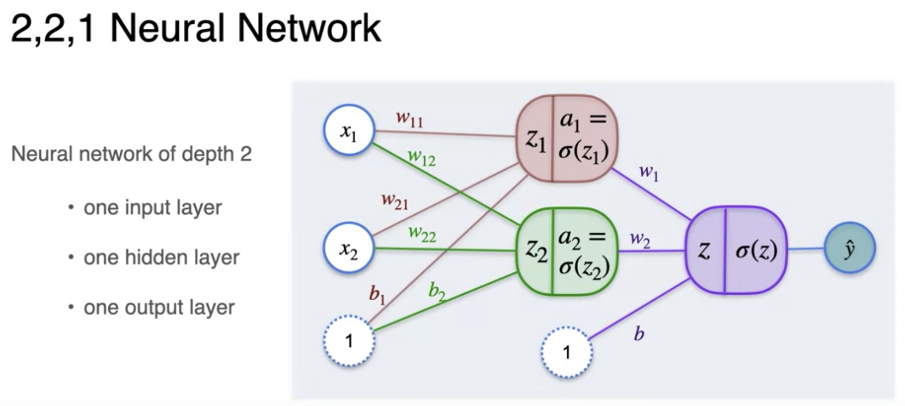
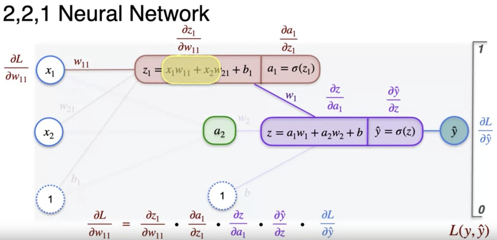
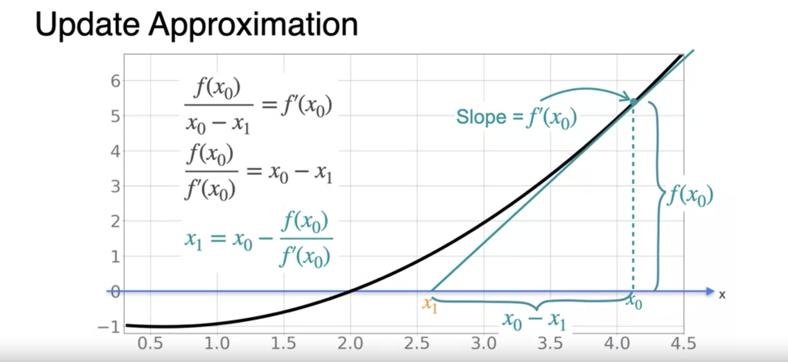
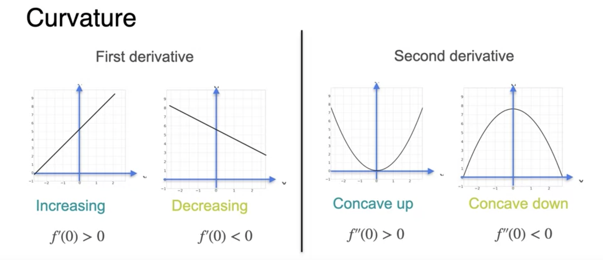
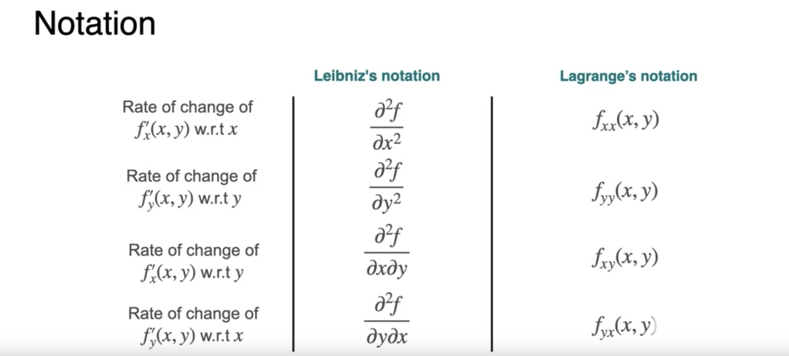
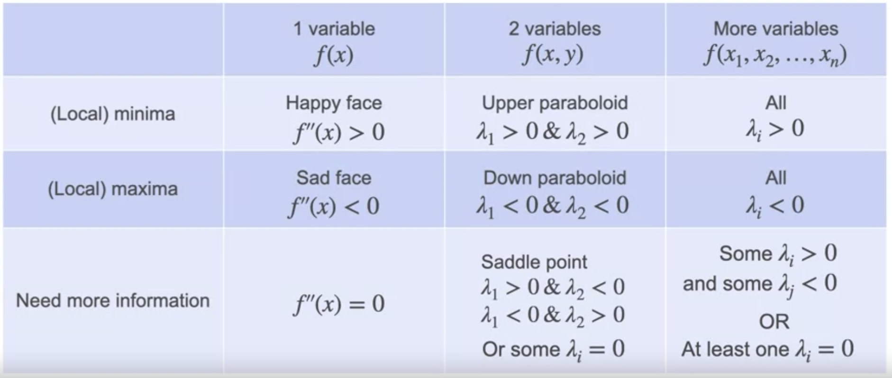

# Week 3

Regression problem motivation: predict the price of a house given the size of a house.

We are going to model this problem using a Single Layer Neural Network Perceptron. A
perceptron is the fundamental unit of neural networks.

The goal is to build the best possible model.

As input, we have 2 features: the size of a house and its  number of rooms.

We label our inputs $x_1$ and $x_2$, the size of a house and number of rooms
respectively. In our specific case we only have 2 inputs resulting in 2 input nodes, but imagine we have $n$ inputs, then we would have $n$ input nodes.

The inputs are connected to a summation function, $\Sigma$, whose output results in
$\hat y$, the actual prediction.

As part of the summation function, each feature is multiplied by a weight indicating its
importance: $w_1$ and $w_2$. In addition, a bias term $b$ is added:

$$
\hat y = w_1 x_1 + w_2 x_2 + b
$$

Revisiting our goal, it is to find the best weights and bias that optimize predictions.
We do this by minimizing error (distance from the price of the house) using a Loss
Function.

We can do this by measuring the differences between predictions and actual values:
$y - \hat y$. In order to resolve negative differences, we square the error:
$(y - \hat y)^2$. In addition, the error is also multiplied by $\frac{1}{2}$ so that
when the derivative is taken, the 2 is canceled.

Our Loss function which can be used for each point is:

$$
\mathcal{L}(y, \hat y) = \frac{1}{2}(y - \hat y)^2
$$

To restate our goal: find $w_1$, $w_2$, $b$ that give $\hat y$ with the least error.

One such method that we have learned that can be used to minimize functions is Gradient
Descent, which will be used to minimize our Loss function (which implies we found the
best model for the dataset).

---

# Regression with a Perceptron using Gradient Descent

Prediction function used to calculate perceptron output (forward propagation)

$$
\hat y = w_1 x_1 + w_2 x_2 + b
$$

Loss function used to compute cost

$$
\mathcal{L}(y, \hat y) = \frac{1}{2}(y - \hat y)^2
$$

Gradient descent update step

$$
w_1 \leftarrow w_1 - \alpha \frac{\partial \mathcal{L}}{\partial w_1}
$$

$$
w_2 \leftarrow w_2 - \alpha \frac{\partial \mathcal{L}}{\partial w_2}
$$

$$
b \leftarrow b - \alpha \frac{\partial \mathcal{L}}{\partial b}
$$

---

Differentiating using the chain rule

$$
\frac{\partial \mathcal{L}}{\partial w_1} = \frac{\partial \mathcal{L}}{\partial \hat y} \cdot \frac{\partial \hat y}{\partial w_1}
$$

$$
\frac{\partial \mathcal{L}}{\partial w_2} = \frac{\partial \mathcal{L}}{\partial \hat y} \cdot \frac{\partial \hat y}{\partial w_2}
$$

$$
\frac{\partial \mathcal{L}}{\partial b} = \frac{\partial \mathcal{L}}{\partial \hat y} \cdot \frac{\partial \hat y}{\partial b}
$$

---

Calculate the partial derivatives

$$
\frac{\partial \hat y}{\partial w_1} = x_1
$$

$$
\frac{\partial \hat y}{\partial w_2} = x_2
$$

$$
\frac{\partial \hat y}{\partial b} = 1
$$

$$
\frac{\partial \mathcal{L}}{\partial \hat y} = -(y - \hat y)
$$

---

Substitute back to calculate gradients (backward propagation)

$$
\frac{\partial \mathcal{L}}{\partial w_1} = \frac{\partial \mathcal{L}}{\partial \hat y} \cdot \frac{\partial \hat y}{\partial w_1} = -(y - \hat y) x_1
$$

$$
\frac{\partial \mathcal{L}}{\partial w_2} = \frac{\partial \mathcal{L}}{\partial \hat y} \cdot \frac{\partial \hat y}{\partial w_2} = -(y - \hat y) x_2
$$

$$
\frac{\partial \mathcal{L}}{\partial b} = \frac{\partial \mathcal{L}}{\partial \hat y} \cdot \frac{\partial \hat y}{\partial b} = -(y - \hat y)
$$

---

Perform parameter updates

$$
w_1 \leftarrow w_1 - \alpha (-x_1(y - \hat y))
$$

$$
w_2 \leftarrow w_2 - \alpha (-x_2(y - \hat y))
$$

$$
b \leftarrow b - \alpha (-(y - \hat y))
$$

# Classification with a Perceptron

While the goal of a regression problem is to predict a continuous result, a regression problem's goal is to predict an outcome from a discrete finite set.

Recall that in regression, given our

- inputs $x_1, \dots, x_n$
- weights $w_1, \dots, w_n$
- bias $b$

the result $z$ is a continuous number

$$
z = x_1 w_1 + \dots + x_n w_n
$$

In classification we apply an **activation function** $\sigma$ to $z$ to transform the
continuous output to discrete.

In our case we will use a [sigmoid function](https://en.wikipedia.org/wiki/Sigmoid_function) as the activation function.

$$
\sigma(z) = \frac{1}{1 + e^{-z}}
$$

A benefit of the sigmoid function is that its derivative can be simplified to a simple
calculation

$$
\begin{align*}
\sigma(z) & = \frac{1}{1 + e^{-z}} \\
& = (1 + e^{-z})^{-1}
\end{align*}
$$

---

$$
\begin{align*}
\frac{d}{dz} \sigma(z) & = \frac{d}{dz} (1 + e^{-z})^{-1} \\
& = -1 (1 + e^{-z})^{-1 -1} (\frac{d}{dz}(1 + e^{-z})) \\
& = -1 (1 + e^{-z})^{-2} (\frac{d}{dz}(a) + \frac{d}{dz}(e^{-z})) \\
& = -1 (1 + e^{-z})^{-2} (0 + e^{-z}(\frac{d}{dz}(-z))) \\
& = -1 (1 + e^{-z})^{-2} (e^{-z})(-1) \\
& = (1 + e^{-z})^-2 (e^{-z}) \\
& = \frac{1}{(1 + e^{-z})^2} (e^{-z}) \\
& = \frac{e^{-z}}{(1 + e^{-z})^2} \\
& = \frac{e^{-z} + 1 - 1}{(1 + e^{-z})^2} \\
& = \frac{1 + e^{-z} - 1}{(1 + e^{-z})^2} \\
& = \frac{1 + e^{-z}}{(1 + e^{-z})^2} - \frac{1}{(1 + e^{-z})^2} \\
& = \frac{1 + e^{-z}}{(1 + e^{-z})^2} - \left(\frac{1}{(1 + e^{-z})}\right) \left(\frac{1}{(1 + e^{-z})}\right) \\
& = \frac{1}{(1 + e^{-z})} \left(1 - \frac{1}{(1 + e^{-z})}\right)
\end{align*}
$$

Recall that

$$
\sigma(z) = \frac{1}{1 + e^{-z}}
$$

Therefore

$$
\frac{d}{dz} \sigma(z) = \sigma(z) (1 - \sigma(z))
$$

# Error function for classification problems

Research has shown that the **log loss** function works best as an error function in
classification problems (vs other error functions we've seen such as $y - \hat y$,
square error, etc).

$$
\mathcal{L}(y, \hat y) = -y \ln(\hat y) - (1 - y) \ln (1 - \hat y)
$$

The log loss function above has a small result when $y$ and $\hat y$ are _close_ to each
other. And a large result when they are _far_ from one another.

---

Calculating partial derivatives

$$
\frac{\partial \mathcal{L}}{\partial b} = \frac{\partial \mathcal{L}}{\partial \hat y} \cdot \frac{\partial \hat y}{\partial b}
$$

$$
\frac{\partial \mathcal{L}}{\partial w_1} = \frac{\partial \mathcal{L}}{\partial \hat y} \cdot \frac{\partial \hat y}{\partial w_1}
$$

$$
\frac{\partial \mathcal{L}}{\partial w_2} = \frac{\partial \mathcal{L}}{\partial \hat y} \cdot \frac{\partial \hat y}{\partial w_2}
$$

---

$$
\frac{\partial \mathcal{L}}{\partial \hat y} = \frac{-(y - \hat y)}{\hat y(1 - \hat y)}
$$

$$
\frac{\partial \mathcal{L}}{\partial b} = \hat y (1 - \hat y)
$$

$$
\frac{\partial \mathcal{L}}{\partial w_1} = \hat y (1 - \hat y) x_1
$$

$$
\frac{\partial \mathcal{L}}{\partial w_2} = \hat y (1 - \hat y) x_2
$$

---

$$
\frac{\partial \mathcal{L}}{\partial b} = -(y - \hat y)
$$

$$
\frac{\partial \mathcal{L}}{\partial w_1} = -(y - \hat y) x_1
$$

$$
\frac{\partial \mathcal{L}}{\partial w_2} = -(y - \hat y) x_2
$$

---

Update step

$$
w_1 \leftarrow w_1 - \alpha (-x_1 (y - \hat y))
$$

$$
w_2 \leftarrow w_2 - \alpha (-x_2 (y - \hat y))
$$

$$
b \leftarrow b - \alpha (-(y - \hat y))
$$

# Classification with a Neural Network

A neural network is a series of perceptrons organized in layers where the output from
one layer is used as the input for the next layer.

---

Minimizing log loss (training)

The partial derivatives at each layer tell us how to adjust weights at each layer in
order to minimize the log loss function.

$$
\frac{\partial \mathcal{L}}{\partial w_{11}} = -x_1 w_1 a_1 (1 - a_1)(y - \hat y)
$$

$$
w_{11} \leftarrow w_{11} - \alpha \frac{\partial \mathcal{L}}{\partial w_{11}}
$$

$$
w_{11} \leftarrow w_{11} - \alpha - x_1 w_1 a_1 (1 - a_1)(y - \hat y)
$$

---

The forward propagation step in gradient descent that begins at input layer of the neural
network and ends at the output layer in order to calculate the output $\hat y$ whose
error seeks to be minimized using the loss function.

Forward propagation is followed by **backpropagation**, which begins at the output layer
and ends and the input layer. Its purpose is to perform the "update step" during training,
that is, updating the parameters in the network (the _weights_ and _biases_).

# Newton's Method

Is a way to find the zeros of a function through approximation.  It can be adapted for
optimization problems as an alternative to gradient descent.

Given a function $f(x)$, the goal is to find $x$ such that $f(x) = 0$.

Start with a random $x_0$ that is not a zero of the function, then take its derivative
and find where the tangent intersects the x-axis. Call this point $x_1$. We notice that
$x_1$ is much closer than $x_0$ to the actual zero of the function. Then iterate to find
the derivative of $x_1$, and so on.

In general,

$$
x_{k+1} = x_k - \frac{f(x_k)}{f'(x_k)}
$$

Recall that in order to optimize some function, $g(x)$, we need to find the zeros of its
derivative, $g'(x)$.

Newton's method finds the zero of some function, $f(x)$.

To augment Newton's method for optimization, we can let $f(x)$ be $g'(x))$ and then
$f'(x)$ is $(g'(x))'$, that is, the second derivative.

$$
\begin{align*}
f(x) & \leftarrow g'(x) \\
f'(x) & \leftarrow (g'(x))' \\
\end{align*}
$$

Start with some $x_0$, then iterate

$$
x_{k+1} = x_k - \frac{g'(x_k)}{(g'(x_k))'}
$$

And repeat until a minimum candidate has been found.

---

Notation:

$$
\begin{align*}
\frac{d}{dx} \left(\frac{df(x)}{dx}\right) & = \frac{d^2f(x)}{dx^2}  \tag{Leibniz} \\
& = f''(x)  \tag{Lagrange}
\end{align*}
$$

Recall the example used to describe the first derivate: velocity, the rate of change in
distance per unit time. The second derivative then can be described as _acceleration_.

Given $x = distance$:

$$
\begin{align*}
v & = \frac{dx}{dt}  \tag{velocity} \\
a & = \frac{dv}{dt} \tag{acceleration} \\
\end{align*}
$$

_Zero_ acceleration implies constant velocity, _positive_ acceleration implies increasing
velocity, and _negative_ acceleration implies decreasing velocity.

If the second derivative of a function $f(x)$, i.e., $f''(x)$ or $\frac{d^2}{dx^2}f(x)$ is
equal to $0$ **for every value of $x$**, then $f'(x)$ must be a constant and $f(x)$ is a
line.

The second derivative gives a measure of the amount by which a curve deviates from a
straight line. This is called **curvature**.

When the second derivative is positive ($> 0$), the curvature is said to be "concave up"
or "convex".

When the second derivative is negative($< 0$), the curvature is said to be "concave down".

When the second derivative is 0 and there is said to be no curvature.

Using this information we can see that the second derivate describes maxima and minima and
can be used for optimizing functions.

Recall that points where the first derivate is 0 are _candidates_ for maxima or minima.
The second derivate tells us which are maxima and which are minima.

---

The Hessian

Recall the description of the first derivatives of a function of 2 variables:

Function:

$$
f(x, y)
$$

First derivative:

$$
f_x(x, y)  \tag{Rate of change wrt {$x$}}
$$

$$
f_y(x, y)  \tag{Rate of change wrt {$y$}}
$$

When combined you get the _gradient_

$$
\nabla f =
\begin{bmatrix}
f_x(x, y) \\
f_y(x, y)
\end{bmatrix}
$$

---

Hessian Matrix

Similar to how the gradient matrix represents the first derivatives, the _Hessian_
matrix represents the second derivatives.

Given $f(x, y)$

$$
H =
\begin{bmatrix}
f_{xx}(x, y) & f_{xy}(x, y) \\
f_{yx}(x, y) & f_{yy}(x, y) \\
\end{bmatrix}
$$

---

An example with 2 variables:

$$
f(x, y) = 2x^2 = 3y^2 - x y \\
$$

$$
H(0, 0) =
\begin{bmatrix}
4 & -1 \\
-1 & 6
\end{bmatrix} \\
$$

$$
\begin{align*}
det(H(0, 0) - \lambda I) & = det\left(
\begin{bmatrix}
4 - \lambda & -1 \\
-1 & 6 - \lambda \\
\end{bmatrix}
\right) \\
& = (4 - \lambda)(6 - \lambda) - (-1)(-1) \\
& = \lambda^2 - 10 \lambda + 23
\end{align*}
$$

Both eigenvalues are $> 0$ (concave up), so the matrix is called _positive definite_ and
$H(0, 0)$ is a local minima.

$$
\lambda_1 = 6.41 \\
$$

$$
\lambda_2 = 3.59 \\
$$

In cases where both eigenvalues are $< 0$ (concave down), the matrix is _negative
definite_ and $H(0, 0)$ is a local maxima.

When eigenvalues are neither all positive or all negative, $H(0, 0)$ is not a minimum or
maximum, but a _saddle point_.

In general:

---

Newton's Method for Two Variables

Recall 1 variable

$$
\begin{align*}
x_{k+1} & = x_k - \frac{f'(x_k)}{f''(x_k)} \\
& = x_k - f''(x_k)^{-1} f'(x_k)
\end{align*}
$$

Then for 2 variables

$$
\begin{bmatrix}
x_{k+1} \\
y_{k+1} \\
\end{bmatrix} =
\begin{bmatrix}
x_k \\
y_k \\
\end{bmatrix} -
H^{-1}(x_k, y_k) \nabla f(x_k, y_k)
$$
