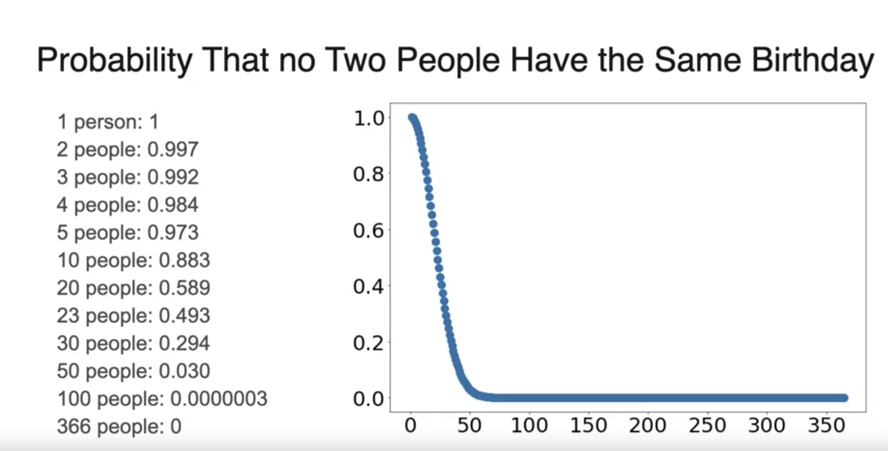

# Week 1

What is probability? A measure of how likely an event is to occur.

# Introduction

Given a school of 10 children where 3 play soccer and 7 don't. Find the probability that
a child picked at random plays soccer.

We use $P(soccer)$ to denote the probability that a child plays soccer.

$$
P(\text{soccer}) = \frac{\text{soccer}}{\text{total}} = \frac{3}{10} = 0.3
$$

The numerator corresponds to the **event** and the denominator the **sample space**, the
total number of possible outcomes.

An **experiment** is any process that produces an outcome that is uncertain.

## Coin flip example

$$
P(\text{H}) = \frac{\text{H}}{\text{H, T}} = \frac{1}{2} = \frac{1}{2} = 0.5
$$

$$
P(\text{HH}) = \frac{\text{HH}}{\text{HH, HT, TH, TT}}
= \frac{1}{4} = 0.25
$$

$$
P(\text{HHH}) = \frac{\text{HHH}}{\text{HHH, HHT, HTH, HTT, THH, THT, TTH, TTT}}
= \frac{1}{8} = 0.125
$$

## Dice example

$$
P(6) = \frac{6}{1, 2, 3, 4, 5, 6} = \frac{1}{6}
$$

$$
P(6, 6) = \frac{1}{6} \cdot \frac{1}{6} = \frac{1}{36}
$$

The event of rolling 2 6's is 1 and the sample space of total possible rolls (outcomes)
is 36.

# Complement of event probability

If an event has a probability of occurring 75%, then the complement event or the
probability that it does not occur is 25%.

In general, the **Complement Rule** states:

$$
P(\neg A) = 1 - P(A)
$$

Using a coin flip example

$$
P(not \space \text{HHH}) = 1 - P(\text{HHH}) = 1 - \frac{1}{8} = \frac{7}{8}
$$

Using a dice example

$$
P(not \space 6) = 1 - P(6) = 1 - \frac{1}{6} = \frac{5}{6}
$$

# Sum of probabilities

## Disjoint events

At a school kids _can only play one sport_.  The probability that a kid plays soccer is 30%.
The probability that a kid plays basketball is 40%

What is the probability that a kid plays soccer or basketball?

$$
P(\text{soccer} \cup \text{basketball}) = P(\text{soccer}) + P(\text{basketball})
$$

In general, for **disjoint** (mutually exclusive) events

$$
P(A \cup B) = P(A) + P(B)
$$

When throwing a 6-side die, what is the probability of obtaining and even number or a 5?

$$
P(\text{even number or 5}) = P(\text{even number}) + P(5) = \frac{3}{6} + \frac{1}{6}
= \frac{4}{6} = \frac{2}{3}
$$

## Joint events

At another school, kids _can play as many sports as they want_. The probability that a
kid plays soccer is 0.6 and the probability that a kid plays basketball is 0.5.

What is the probability that a kid plays soccer or basketball?

With the given information we cannot infer the probability. We need to know the number of
kids that play soccer and the number of kids that play basketball.

We find out that

6 kids play soccer

$$
|S| = 6
$$

5 kids play basketball

$$
|B| = 5
$$

3 kids play soccer and basketball

$$
|S \cap B| = 3
$$

Then the  **Inclusion-exclusion principle** states

$$
|S \cup B| = |S| + |B| - |S \cap B| = 6 + 5 - 3 = 8
$$

And 8 kids play soccer or basketball

Restated in terms of probability

$$
\begin{align*}
P(S) & = 0.6 \\
P(B) & = 0.5 \\
P(S \cap B) & = 0.3 \\
P(S \cup B) & = 0.8 \\
\end{align*}
$$

In general, for **joint** (non-mutually exclusive) events

$$
P(A \cup B) = P(A) + P(B) - P(A \cap B)
$$

We subtract the events that we have over counted. That is, the events that belong to both
sets.

## Independence

Independence occurs when the occurrence of one event does not affect the probability of
the occurrence of another event.

In a school with 100 kids where 40 kids like soccer and 60 don't, we randomly split
the children into 2 rooms: room 1 with 30 kids and room 2 with 70 kids.

How many kids in room 1 can we expect to like soccer?

$$
\frac{40}{100} \cdot 30 = 12
$$

$$
\begin{align*}
P(\text{soccer and room 1}) & = P(S \cap R_1) \\
& = P(S) \cdot P(R_1) \\
& = 0.12 \\
\end{align*}
$$

The **Product rule** for **independent** events

$$
P(A \cap B) = P(A) \cdot P(B)
$$

Dice example

What is the probability of rolling 10 sixes?

$$
P(\text{10 sixes}) = {\left(\frac{1}{6}\right)}^{10}
$$

## Birthday problem

You have 30 friends at a party. What do you think is more likely:

- That there exist two people with the same birthday
- That no two of them have the same birthday
- (Assume the year has 365 days, no one has birthday on Feb 29)

The probability that in a group of 30 people, **no 2 people** have the same birthday

$$
\frac{365}{365} \cdot \frac{364}{365} \cdot \frac{363}{365} \cdot \ldots \cdot \frac{336}{365}
= 0.293683757
$$

# Conditional Probability

Conditional probability concerns calculating the probability of an event given that
another event has already occurred.

## Coin flip example

What is the probability of landing heads twice given the first coin flip is heads?

$$
P(HH \mid \text{1st is H}) = \frac{HH}{HH, HT} = \frac{1}{2}
$$

## Dice example

What is the probability that the first die is 6 and the sum is 10?

This can be answered by first reducing the sample space to just those outcomes with 6
as the first die roll. The only possible roll for the next die that results in the sum
of both both dice being 10 is 4, so the probability is $\frac{1}{36}$.

Another way to solve this problem is using the Product rule:

$$
P(\text{1st is 6}) = \frac{6}{36} = \frac{1}{6}
$$

$$
P(\text{sum = 10} \mid \text{1st is 6}) = \frac{1}{6}  \tag{(6,1), (6,2), ...,  (6,6)}
$$

$$
P(\text{1st is 6} \cap \text{sum = 10}) = P(\text{1st is 6}) \cdot P(\text{sum = 10} \mid \text{1st is 6})
$$

The **General Product rule** supporting **conditional** events

$$
P(A \cap B) = P(A) \cdot P(B \mid A)
$$

$$
P(B \mid A) = \frac{P(A \cap B)}{P(A)}
$$

$$
P(A \mid B) = \frac{P(A \cap B)}{P(B)}
$$

When events are independent, $P(B \mid A) = P(B)$

# Bayes Theorem

$$
P(A \mid B) = \frac{P(A) \cdot P(B \mid A)}{P(A) \cdot P(B \mid A) + P(\neg A) \cdot P(B \mid \neg A)}
$$

- $P(A)$ is the initial degree of belief in $A$
- $P(\neg A)$ is the initial degree of belief in $not \space A$
- $P(B \mid A)$ is the belief in $B$ given $A$ is true
- $P(B \mid \neg A)$ is the belief in $B$ given $A$ is false
- $P(A \mid B)$ is the probability of $A$ after taking $B$ into account

In [simple](https://en.wikipedia.org/wiki/Bayes%27_theorem#Simple_form) form

$$
P(A \mid B) = \frac{P(B \mid A) \cdot P(A)}{P(B)}
$$

## Spam example

In total we have 100 emails, 20 are **actually spam**, meaning 80 are **not spam**.  Our
initial classifier naively marks some 20% as spam since that's all we know so far.

We notice that spam emails tend to contain the word `lottery` and we find that out of the
actual spam emails, 14 of them contain `lottery` and out of the non-spam emails, 10 have
the word `lottery`.

What is the probability that an email containing `lottery` is spam?

$$
\begin{align*}
P(\text{spam} \mid \text{lottery}) & = \frac{\text{spam and lottery}}{\text{all lottery}} \\
& = \frac{14}{24} \\
& = \frac{7}{12} \\
& = 0.583 \\
\end{align*}
$$

Note that we only need to consider the emails containing `lottery`.

---

Using Bayes Theorem

$$
P(\text{spam}) = \frac{20}{100} = 0.2
$$

$$
P(\text{not spam}) = \frac{80}{100} = 0.8 \tag{also 1 - 0.2}
$$

$$
P(\text{lottery} \mid \text{spam}) = \frac{14}{20} = 0.7
$$

$$
P(\text{lottery} \mid \neg \text{spam}) = \frac{10}{80} = 0.125
$$

$$
\begin{align*}
P(\text{spam} \mid \text{lottery}) & = \frac{P(\text{spam}) \cdot P(\text{lottery} \mid \text{spam})}{
P(\text{spam}) \cdot P(\text{lottery} \mid \text{spam}) + P(\neg \text{spam}) \cdot P(\text{lottery} \mid \neg \text{spam})} \\
& = \frac{0.2 \cdot 0.7}{(0.2 \cdot 0.7) + (0.8 \cdot 0.125)} \\
& = 0.583
\end{align*}
$$

# Prior and Posterior

**Prior** is the original probability that can be calculated not knowing anything else.
Something then happens called the **Event**.  Given information from the event, we can
calculate a **Posterior** probability.

$$
P(A) \tag{Prior}
$$

$$
E \tag{Event}
$$

$$
P(A \mid E) \tag{Posterior}
$$

# Naive Bayes Model

When we assume that events are independent, we are using a Naive Bayes model. This
provides an easier way to _estimate_ probabilities when considering multiple events.

Note that this is equivalent to using the product rules for independent events

$$
P(A \cap B \cap \dots \cap C) = P(A) \cdot P(B) \cdot \ldots \cdot P(C)
$$
