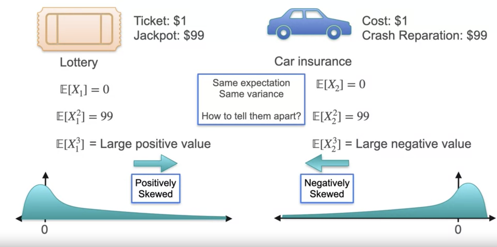

Week 2

# Mean Example

Mean is computed by summing the values in a dataset and dividing by the size of the
dataset.

Can think of calculating mean or average as view data points as histogram and trying
find the "center" if the histogram was put on scale.

This is especially true for continuous distributions: it is the point where you would
balance the curve.

# Median Motivation

Median is computed by ordering the values in a dataset and choosing the middle value.
If the size of the dataset is even, the median is the average of the 2 middle values.

Averages can be deceiving due to outliers and skew the metric.

# Mode

The mode is the value in the dataset that has the highest probability (the largest
number). Note that the mode is not necessarily unique.

# Expected Value

Given a probability distribution (discrete or continuous) and you draw a random sample,
what you expect this sample to be on average is the **expected value**.


For example, you play a coin flip game with a friend where for each flip:
- Heads you win $10
- Tails you win $0

Long term your expected value on average is

$$
\mathbb{E}[X] = 0.5 \cdot \$10 + 0.5 \cdot \$0 = \$5
$$

---

In another game, with each turn you flip 3 coins. For each head you win $1. What is the
maximum amount of money you would pay to play this game.

To solve, again look at the probability distribution and the expected value.

Number of heads:

- 0: {TTT}
- 1: {TTH, THT, HTT}
- 2: {HHT, HTH, THH}
- 3: {HHH}

$$
\mathbb{E}[X] = \frac{(0 \cdot 1) + (1 \cdot 3) + (2 \cdot 3) + (3 \cdot 1)}{8} = 1.5
$$

---

In a dice game example where you roll a single die and are paid the value of the die,
what is the fair price to play the game?

$$
\mathbb{E}[X] = \frac{1 + 2 + 3 + 4 + 5 + 6}{6} = 3.5
$$

---

The Expected value of uniform random variable can be computed by taking the average
value of the endpoints of the uniform distribution in the set of values between $[a, b]$:

$$
\mathbb{E}[X] = \frac{a + b}{2}
$$

# Expected Value of a Function

Given a probability distribution of

- $x_1, p(x_1)$
- $x_2, p(x_2)$
- $x_3, p(x_3)$
- $x_4, p(x_4)$

$$
\mathbb{E}[X] = x_1 \cdot p(x_1) + x_2 \cdot p(x_2) + x_3 \cdot p(x_3) + x_4 \cdot p(x_4)
$$

Then

$$
\mathbb{E}[f(X)] = f(x_1) \cdot p(x_1) + f(x_2) \cdot p(x_2) + f(x_3) \cdot p(x_3) + f(x_4) \cdot p(x_4)
$$

---

In a dice game example where you roll a single die and are paid the _square value_ of the
die, what is the fair price to play the game?

$$
\mathbb{E}[X] = \frac{1 + 2 + 3 + 4 + 5 + 6}{6} = 3.5
$$

$$
\mathbb{E}[X^2] = \frac{1^2 + 2^2 + 3^2 + 4^2 + 5^2 + 6^2}{6} = 15.16667
$$

# Sum of Expectations

Imagine a game where $n$ people who have unique names write their names down on a piece
of paper. The pieces of paper are then distributed to each of the $n$ people at random.
How many people do we expect to receive their own name (the number of correct assignments)?

The answer is 1. But why?

Try the game with 3 people named A, B, C. Then the possible assignments that can occur
are:

```
Correct | Assignment
--------------------
  3     |   A B C
  1     |   A C B
  1     |   B A C
  0     |   B C A
  0     |   C A B
  1     |   C B A
```

The average number of times we can expect correct assignments is:

$$
Average = \frac{3 + 1 + 1 + 0 + 0 + 1}{6} = 1
$$

Restated using Sum of Expectations

$Matches$ is the random variable that counts the number of correct assignments. Then
$\mathbb{E}[Matches]$ is the expected number of correct assignments. And $\mathbb{E}[A]$
is the expected number of times person A will get a correct assignment, which has a
probability of $\frac{1}{3}$.

$$
\begin{align*}
\mathbb{E}[Matches] & = \mathbb{E}[A] + \mathbb{E}[B] + \mathbb{E}[C] \\
& = \frac{1}{3} + \frac{1}{3}+ \frac{1}{3} \\
& = 1
\end{align*}
$$

For $n$ people,

$$
\begin{align*}
\mathbb{E}[Matches] & = \mathbb{E}[X_{person_1}] + \ldots + \mathbb{E}[X_{person_n}] \\
& = \frac{1}{n} + \ldots + \frac{1}{n} \\
& = n \cdot \frac{1}{n} \\
& = 1 \\
\end{align*}
$$

And in general,

$$
\mathbb{E}[X_1 + X_2 + \ldots + X_n] = \mathbb{E}[X_1] + \mathbb{E}[X_2] + \ldots + \mathbb{E}[X_n]
$$

# Variance

Although expected value can tell us a lot about a distribution. It does not tell the
whole store. Two distributions may have the same expected value, but one can be very
narrow and the other can be very wide.

Coin flip example.

Game 1, for each coin flip:

- Heads you win 1 dollar
- Tails you lose 1 dollar

What is the fair price to play this game?  The answer is $0.00

Game 2, for each coin flip:

- Heads you win 100 dollars
- Tails you lose 100 dollars

What is the fair price to play this game?  The answer is $0.00

They both have the same expected value, but the **variance** between winnings is much
greater.

$$
\mathbb{E}[X_1] = \frac{(1) + (-1)}{2} = 0
$$

$$
\mathbb{E}[X_2] = \frac{(100) + (-100)}{2} = 0
$$

Variance is a measure of _spread_ around a distribution's center.

$$
\mathbb{E}[{X_1}^2] = \frac{(1)^2 + (-1)^2}{2} = 1
$$

$$
\mathbb{E}[{X_2}^2] = \frac{(100)^2 + (-100)^2}{2} = 10,000
$$

---

The above value for expectation is almost the definition of variance. But first let's
use another game for motivation.

Game 1
- Heads you win 1 dollar
- Tails you lose 1 dollar

Game 2
- Heads you win 6 dollars
- Tails you **win** 4 dollars

How risky are these two games in comparison? The answer is that they have the same risk.
The answer may be non-intuitive considering the expected values for each of the games are
not the same.

Another way to think of this is that game 2 is equivalent to charging $5 to play game 1

$$
\mathbb{E}[{X_1}^2] = \frac{(-1)^2 + (1)^2}{2} = 1
$$

$$
\mathbb{E}[{X_2}^2] = \frac{(4)^2 + (6)^2}{2} = 26
$$

Notice that the spread is the same for both games with value **2** ($[-1, 1], [4, 6]$).

$$
\mathbb{E}[X_1] = \frac{(-1) + (1)}{2} = 0
$$

$$
\mathbb{E}[X_2] = \frac{(4) + (6)}{2} = 5
$$

After "centering" game 2 and putting the average/mean at 0, we can see that the risks are
the same: $4 - 5 = -1$ and $6 - 5 = 1$.

Given mean $\mu$, we then define **variance** as the expectation of our variable $X$ after centering it at 0, and then taking its square (squared distance from 0):

$$
\mathbb{E}[X] = \mu
$$

$$
Var(X) = \mathbb{E}[(X - \mu)^2]
$$

After expansion and simplification of the above, we can also write variance as

$$
Var(X) = \mathbb{E}[X^2] - \mathbb{E}[X]^2
$$

# Standard Deviation

It is sometimes more useful to have a metric that describes a distribution in terms of
the distribution's own units. Variance gives us the units of the distribution squared. If
we take the square root of the variance that gives us **standard deviation**.

It measures the spread of the distribution using the units of the distribution.

$$
std(X) = \sqrt{Var(X)}
$$

---

When discussing normal distributions, it is common to describe the size of the area under
the curve in terms of standard deviations.

- 68% of the area is within 1 sigma (1 standard deviation of the mean)
- 95% of the area is within 2 sigma (2 standard deviations of the mean)
- 99.7% of the area is within 3 sigma (3 standard deviations of the mean)


# Notation

$X$ follows a Normal distribution with _parameters_ of mean $\mu$ and standard deviation
$\sigma$.

$$
X \sim \mathcal{N}(\mu, \sigma)
$$

# Sum of Gaussians


In general,

$$
W = aX + bY
$$

$$
\text{Independent} \left \lbrace \begin{matrix}
X \sim \mathcal{N}(\mu_X, \sigma_X) \\
Y \sim \mathcal{N}(\mu_Y, \sigma_Y) \\
\end{matrix}
\right.
$$

$$
\rightarrow W \sim \mathcal{N}\left( a \mu_X + b \mu_Y,  \sqrt{a^2 \sigma_X^2 + b^2 \sigma_Y^2 } \right)
$$

# Standardizing a Distribution

A distribution is nicer when the mean is centered at 0. So given mean $\mu$, subtract
$\mu$ to get mean = 0. This is the same as saying that the expectation is 0.

This works because expectations are linear (recall that the expectation of a constant is
the constant):

$$
\mathbb{E}[X + Y] = \mathbb{E}[X] + \mathbb{E}[Y]
$$

$$
\begin{align*}
\mathbb{E}[X - \mu] & = \mathbb{E}[X] - \mathbb{E}[\mu] \\
& = \mathbb{E}[X] - \mu \\
& = 0 \\
\end{align*}
$$

Analogously, it is also more helpful when the standard deviation is 1.

$$
X \leftarrow \frac{X}{\sigma}
$$

$$
Var(\frac{X}{\sigma}) = \frac{1}{\sigma^2} Var(X)
$$

$$
\begin{align*}
std(\frac{X}{\sigma}) & = \frac{1}{\sigma} std(X) \\
& = \frac{\sigma}{\sigma} \\
& = 1 \\
\end{align*}
$$

In summary, to **standardize** a distribution $X$ we **center** the mean at 0 and
**scale** the standard deviation to 1 by subtracting $\mu$ from the mean and dividing the
standard deviation by $\sigma$ respectively.

$$
X - \mu
$$

$$
\frac{X - \mu}{\sigma}
$$

# Skewness and Kurtosis

Given random variable $X$ that can take values $x_1, x_2, ..., x_n$ with respective
probabilities $p_1, p_2, ..., p_n$, then the **moments** of the distribution of $X$ are:

$$
\begin{align*}
\mathbb{E}[X] & = p_1 x_1 + p_2 x_2 + ... + p_n x_n   \tag{1st moment} \\
\mathbb{E}[X^2] & = p_1 x_1^2 + p_2 x_2^2 + ... + p_n x_n^2   \tag{2nd moment} \\
\vdots \\
\mathbb{E}[X^k] & = p_1 x_1^k + p_2 x_2^k + ... + p_n x_n^k   \tag{kth moment} \\

\end{align*}
$$

## Skewness

Imagine a scenario comparing winning a lottery vs selling car insurance.

Lottery: ticket costs $1, jackpot is $100

- You win $99 with 1% probability
- You lose $1 with 99% probability


Car insurance:  costs $1, crash reparation is $100

- You win $1 with 99% probability
- You lose $99 with 1% probability

Can we tell these scenarios apart using expected values?



$$
\text{Skewness} = \mathbb{E} \left[ \left( \frac{X - \mu}{\sigma} \right)^3 \right]
$$

The 3rd moment can tell us the skewness of the distribution:

- Positively skewed (skew > 0)
- Not skewed (skew = 0)
- Negatively skewed (skew < 0)

## Kurtosis

When a distribution has very large numbers that are far away from the center, even if
their probabilities are tiny, the 4th moment $\mathbb{E}[X^4]$ captures this scenario
which is called **kurtosis**.


$$
\text{Kurtosis} = \mathbb{E} \left[ \left( \frac{X - \mu}{\sigma} \right)^4 \right]
$$

- When the tails of a distribution are "skinny", kurtosis is small
- When the tails of a distribution are "thicker", kurtosis is large

# Quantiles

Given a dataset with 12 values

```
 8.7   14.2   18.3   18.4
23.2   25.9   29.7   35.2
51.2   54.7    65.9  75
```

Notice that these are already sorted left-to-right, top-to-bottom.

The point that splits the data in half (the median) is

$$
\frac{25.9 + 29.7}{2} = 27.8
$$

This is also called the 50% **quantile** or Second **quartile**.

The point that leaves $\frac{1}{4}$ of the data to the left and $\frac{3}{4}$ to the
right is

$$
q_{0.25} = Q1 = \frac{18.3 + 18.4}{2} = 18.35
$$

This is also called the 25% quantile or first quartile.

In general, the **k% quantile** $(q_{\frac{k}{100}})$ is the value that leaves $k\%$ of
the data to the left and $(100 - k)\%$ of the data to the right.


# Box-Plots

Returning to our dataset. Let's compute its **box-plot**. The minimum, maximum, median,
first quartile, and third quartile.

```
 8.7   14.2   18.3   18.4
23.2   25.9   29.7   35.2
51.2   54.7    65.9  75
```

$$
Q1 = q_{0.25} = \frac{18.3 + 18.4}{2} = 18.35
$$

$$
Q2 = q_{0.50} = \frac{25.9 + 29.7}{2} = 27.8
$$

$$
Q3 = q_{0.75} = \frac{51.2 + 54.7}{2} = 52.95
$$

The Interquartile Range (IQR), where 50% of our data lies is

$$
IQR = Q3 - Q1 = 52.95 - 18.35 = 34.6
$$

$$
x_{min} = 8.7
$$

$$
x_{max} = 75
$$


# Kernel Density

Kernel density estimation is a way to estimate the probability density function (PDF) using the dataset itself.

# Violin Plots

A violin plot combines the information in box-plots and kernel density estimation into
a single visualization.


# QQ Plots

Some models assume normally distributed data

- Linear regression
- Logistic regression
- Gaussian Naive Bayes

How to assess normality (Gaussian)? Quantile-quantile (QQ) plots can be used.

- Standardize data
- Compute quantiles
- Compare to Gaussian quantiles

We can see in the follow QQ plot that the data is skewed.


