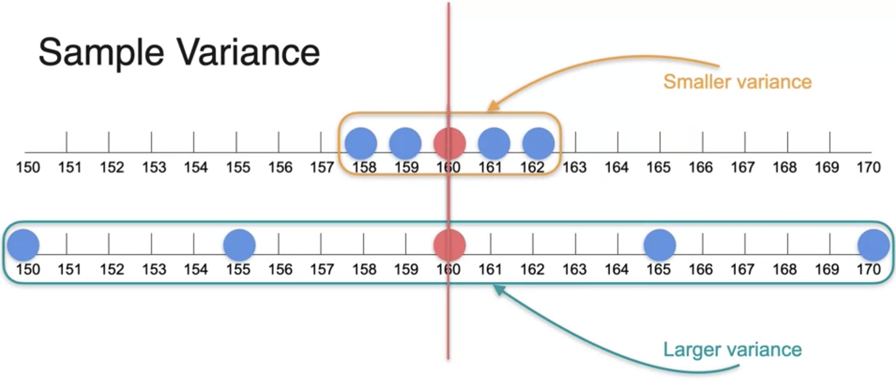
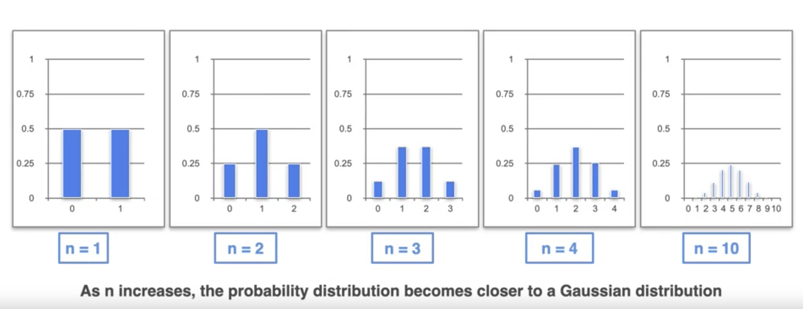
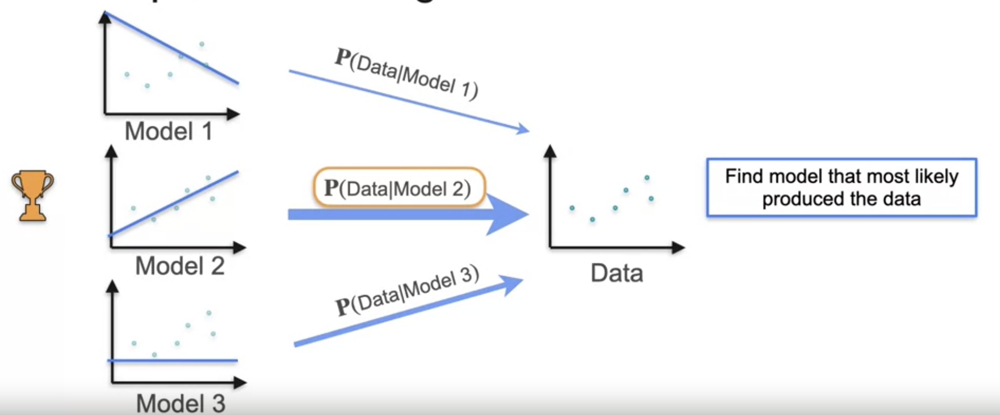
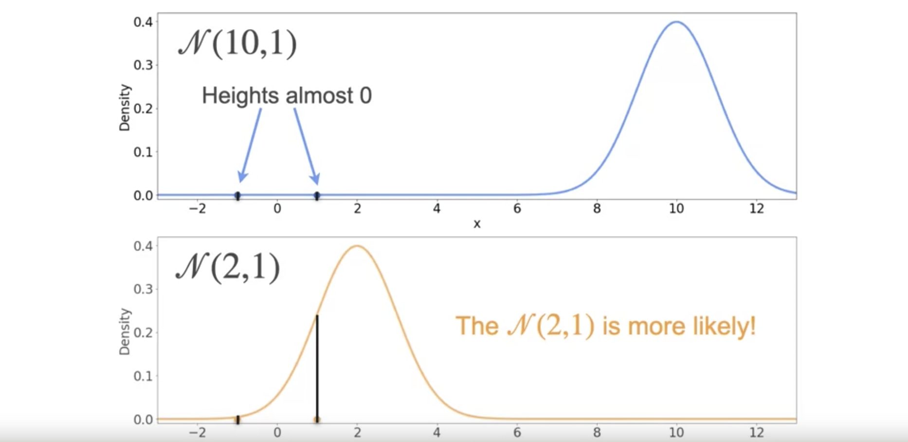
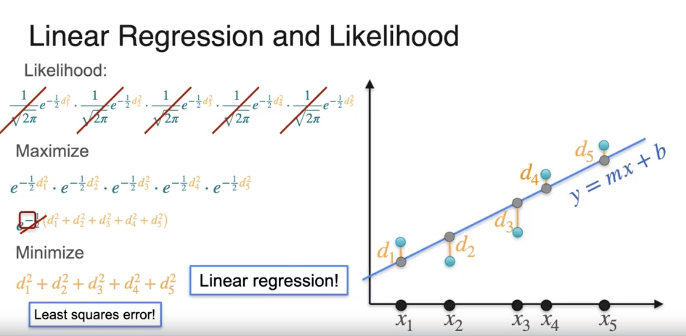
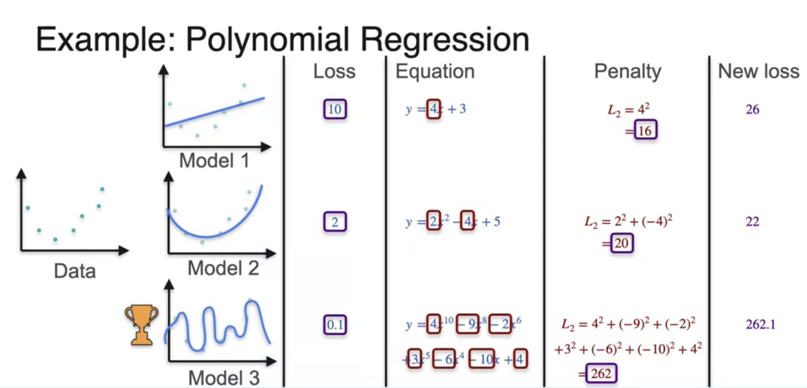

# Week 3

# Population and Sample

**Population** $(N)$ is the entire group of individuals or elements you want to study
which share a common behavior.

**Sample** $(n)$ is the subset of the population you use to draw conclusions about the
population as a whole.

Important properties for samples in order to make representative estimates of population:

- Random
- Independent (repetition allowed)
- Identically distributed

# Sample Mean

Given an actual mean of $\mu$, we define our first sample's mean as $\bar{x}_1$.

In general the larger the sample size, the better the estimate of population mean.

# Sample Proportion

Given an entire population, **population proportion** is

$$
p = \frac{\text{number of items with a given characteristic $(x)$}}{\text{population $(N)$}}
$$

Given a sample of the population, **sample proportion** is

$$
\hat{p} = \frac{\text{number of items with a given characteristic $(x)$}}{\text{sample $(n)$}}
$$

# Sample Variance

Recall that variance describes how much values in a dataset deviate from the mean.
**Population variance** is defined as

$$
\sigma^2 = \frac{1}{N} \sum (x - \mu)^2
$$

where $N$ is population size and $\mu$ is population mean. The question then is how to
estimate **sample variance** using a sample of the population?

The answer is that we divide not by the population size $N$, but 1 minus the sample size
$n$ (Note: in NumPy, this is equivalent to using 1 [Delta Degrees of Freedom](https://numpy.org/doc/stable/reference/generated/numpy.var.html)).

$$
Sample \space Var(x) = \frac{1}{n - 1} \sum (x - \bar{x})^2
$$

where $\bar{x}$ is the mean of the sample.

# Law of Large Numbers

As the sample size increases, the average of the sample will tend to get closer to the
average of the entire population.

- $n$: number of samples
- $X_i$: some estimate $X$ for sample $i$

As $n \rightarrow \infty$

$$
\frac{1}{n} \sum_{i=1}^n X_i \rightarrow \mathbb{E}[X] = \mu_X
$$

given certain conditions:

- Sample is randomly drawn
- Sample size must be sufficiently large
- Observations are independent (of each other)

# Central Limit Theorem

Given any distribution, no matter how skewed, take many samples, compute the mean and
plot them. Your resulting plot will have a normal/Gaussian distribution. This applies
to both discrete and continuous random variables.

As $n$ becomes sufficiently large we get a normal distribution where

$$
\bar x \approx \mu  = n p
$$

$$
\sigma^2 \approx n p (1 - p)
$$

$$
\mu_{\bar x} = \mu
$$

$$
\sigma_{\bar x}^2 = \frac{\sigma^2}{n}
$$

---

More formally, the Central Limit theorem states that that mean of sample means, when
standardized, has a standard normal distribution.

$$
\frac{\frac{1}{n} \sum_{i=1}^n X_i - \mathbb{E}[X]}{\sigma_X} \sqrt{n} \sim \mathcal{N}(0, 1)
$$

# Maximum Likelihood Estimation (MLE) Motivation

Given a number of models and a set of data, find the model that most likely produced the
data by maximizing $P(data \vert model)$.

Example: Linear Regression

# MLE: Bernoulli Example

Coin Example

We want to maximize the probability of flipping a coin 10 times and have the result be
8 heads and 2 tails.

If we can choose the probability of the coin being heads as $p$ and the probability of
it being tails as $1 - p$, then we can write our problem as:

$$
p = P(H)
$$

$$
\text{Likelihood} = L(p; 8H) = p^8 (1 - p)^2
$$

$$
\begin{align*}
\text{Log-likelihood} & = \ell(p; 8H) = \log\left( p^8 (1 - p)^2 \right) \\
& = 8 \log(p) + 2 \log(1 - p)
\end{align*}
$$

We take the log of the likelihood in order to simplify calculations from multiplications
to additions.

Taking the derivative with respect to $p$

$$
\frac{d}{dp} \left( 8 \log(p) + 2 \log(1 - p) \right) =
\frac{8}{p} + \frac{2}{1 - p} (-1)
$$

Solving

$$
\frac{8}{p} + \frac{2}{1 - p} (-1) = 0
$$

$$
\hat{p} = \frac{8}{10}
$$

---

In the general case of $n$ coins and we want to choose $k$ heads (note: $iid$ denotes
"independent and identically distributed random variables".

$$
\boldsymbol{X} = (X_1, \dots , X_n)
$$

$$
X_i \overset{\mathrm{iid}}{\sim} Bernoulli(p)
$$

$$
L(p; x) = P_p(X = x) = \prod_{i=1}^n p_{X_i}(x_i) = \prod_{i=1}^n p^{x_i} (1 - p)^{1 - x_i}
$$

where

$$
\text{If} \space x_i = 1, p^{[x_i]} (1 - p)^{[1 - x_i]} = p
$$

$$
\text{If} \space x_0 = 1, p^{[x_i]} (1 - p)^{[1 - x_i]} = (1 - p)
$$

$$
\sum_{i=1}^n x_i = \text{number of heads}
$$

$$
n - \sum_{i=1}^n x_i = \text{number of tails}
$$

then

$$
\prod_{i=1}^n p^{x_i} (1 - p)^{1 - x_i} = p^{\left( \sum_{i=1}^n x_i \right)} (1 - p)^{\left( n - \sum_{i=1}^n x_i \right)}
$$

and log-likelihood is

$$
\begin{align*}
\ell(p; x) & = \log \left( p^{\left( \sum_{i=1}^n x_i \right)} (1 - p)^{\left( n - \sum_{i=1}^n x_i \right)} \right) \\
& = \left( \sum_{i=1}^n x_i \right) \log(p) + \left( n - \sum_{x=1}^n x_i \right) \log(1 - p)
\end{align*}
$$

Take the derivative with respect to $p$ to maximize

$$
\begin{align*}
\frac{d}{dp} \ell(p; x) & = \frac{d}{dp} \left( \left( \sum_{i=1}^n x_i \right) \log(p) + \left( n - \sum_{x=1}^n x_i \right) \log(1 - p) \right)
\end{align*}
$$

Simplifying and solving for $0$

$$
\frac{\sum_{i=1}^n x_i}{p} + \frac{n - \sum_{i=1}^n x_i}{1 - p} (-1) = 0
$$

$$
\hat{p} = \frac{\sum_{i=1}^n x_i}{n} = \bar{x}
$$

# MLE: Gaussian Example

Given 2 observations $1, -1$

Notice the means of the distributions. We can see that the distribution with **mean**
equal to the mean of the sample, is the distribution that generated the observations with
the highest likelihood.

Similar to mean, the distribution with **standard deviation** equal to the standard
deviation of the of the sample is the distribution that generated the observations with
highest likelihood.

# Reading

[MLE for Gaussian population](./mle-for-gaussian-population.md)

# MLE: Linear Regression

Find the line that most likely produces points using maximum likelihood is exactly the
same as minimizing the least squared error using linear regression.

# Regularization

Even though model 3 has the smallest squared loss, we can see that it does not generalize
well so we come up with a way to apply a **penalty** for more complicated models. In This
case we are using $L_2 \space \text{Regularization}$ to compute a new loss that penalizes
model 3 for its overfitting.

- Model: $y = a_n x^n + a_{n-1} x^{n-1} + ... + a_1 x + a_0$
- Log-loss: $\ell \ell$
- $L_2$ Regularization Error: $a_n^2 + a_{n-1}^ + ... + a_1^2$
- Regularization parameter: $\lambda$
- Regularized error: $\ell \ell + \lambda (a_n^2 + a_{n-1}^ + ... + a_1^2)$

The regularization parameter is usually used to scale the penalty lower.

# Reading

[Bayesian inference and MAP](./bayesian-inference-and-map.md)

# Relationship between MAP, MLE, and Regularization

[Video transcript](./relationship-between-map-mle-and-regularization.txt)
