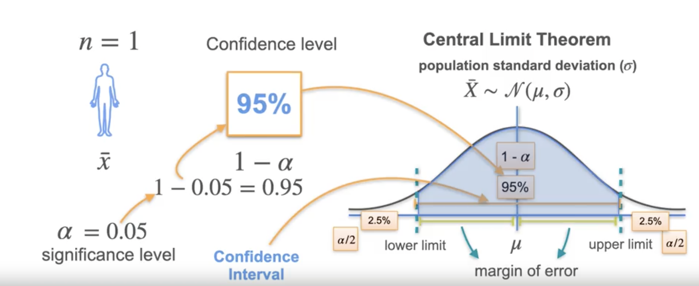
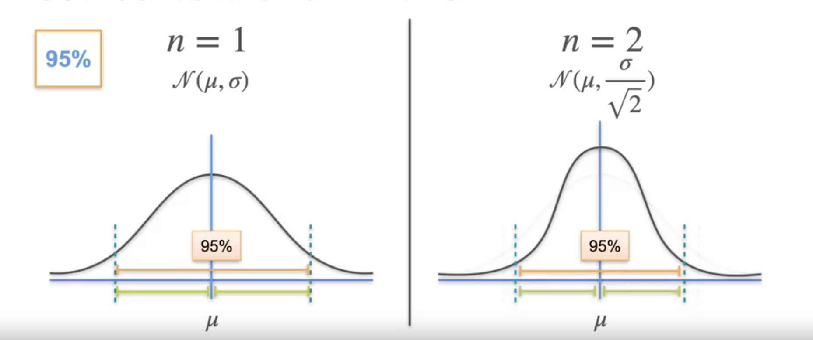
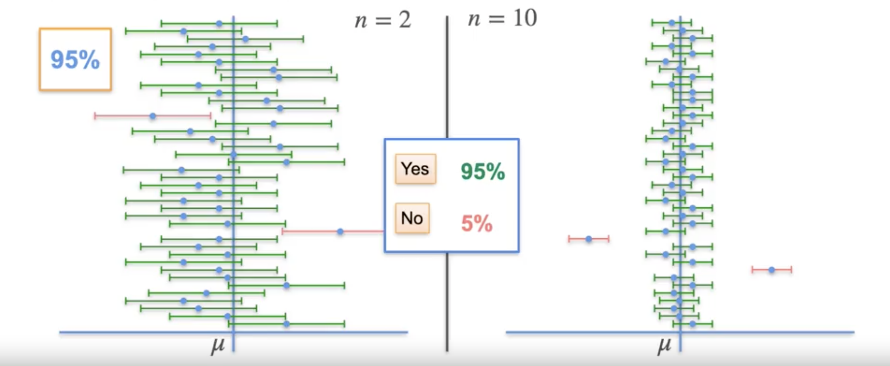
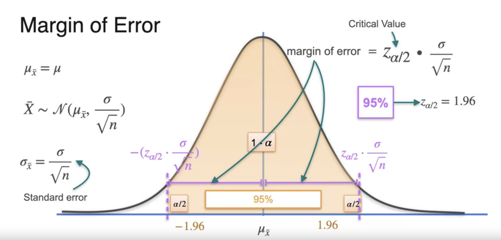
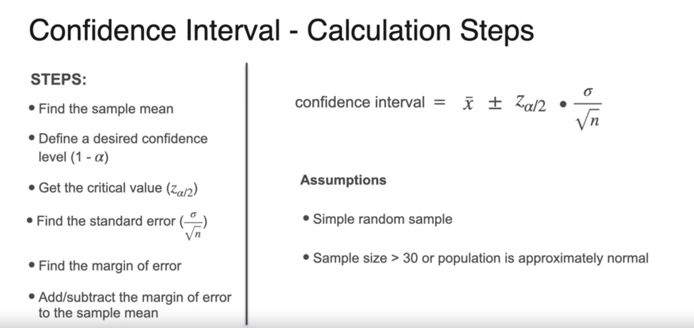
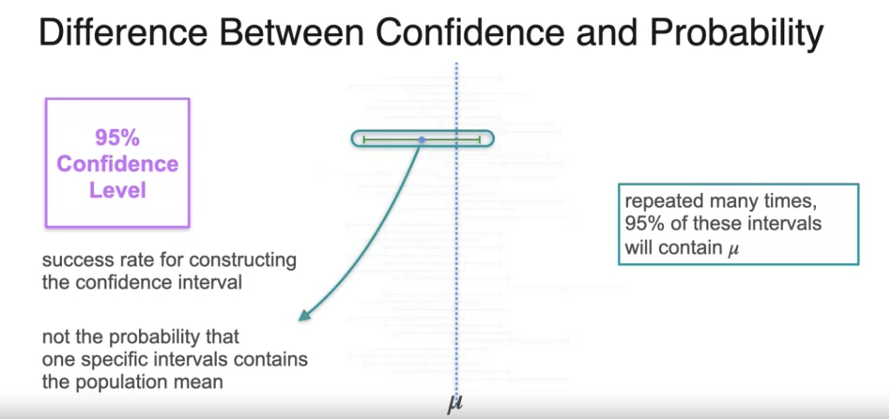
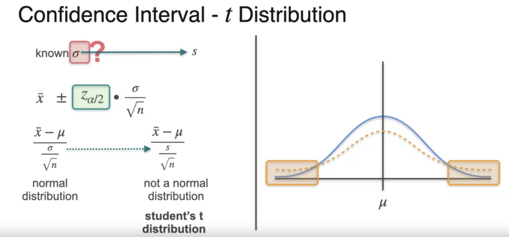
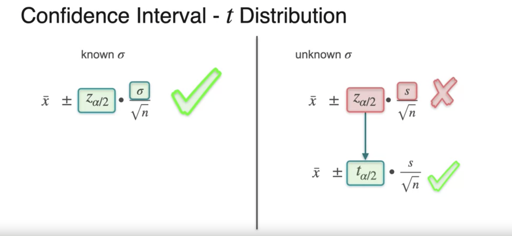
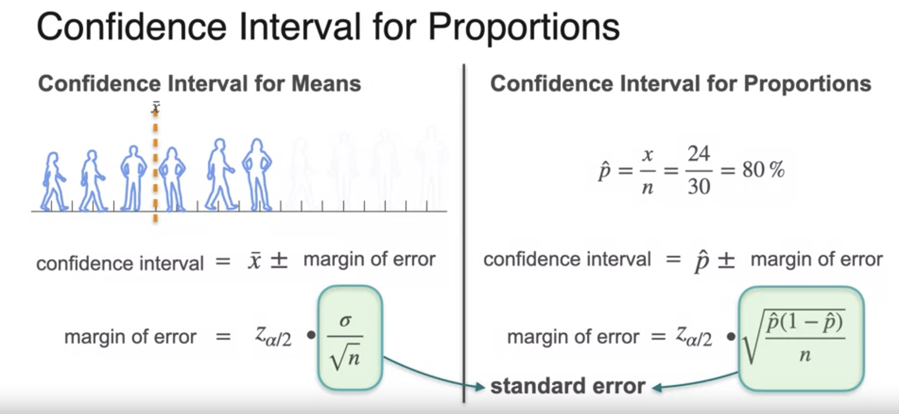
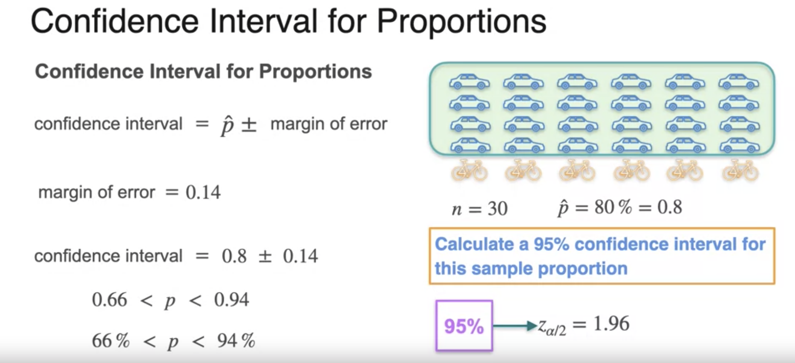

# Week 4

# Z Distribution

A **confidence interval** describes some degree of certainty for sample means.

$$
\text{lower limit} < \bar{x} < \text{upper limit}
$$

$\alpha$ is the significance level and $1 - \alpha$ gives a confidence level.

As the sample size increases, the confidence interval shrinks.

[Transcript](./z-distribution.txt)

# Margin of Error

[Transcript](./margin-of-error.txt)

# Calculation Steps

[Transcript](./confidence-interval-calculation.txt)

# Calculating Sample Size

What is the smallest sample size necessary to obtain a desired margin of error?

$$
\text{margin of error} = Z_{\frac{\alpha}{2}} \cdot \frac{\sigma}{\sqrt{n}}
$$

The necessary sample size $n$ for margin of error $MOE$ is

$$
n \ge \left( \frac{Z_{\frac{\alpha}{2}} \cdot \sigma}{MOE} \right)^2
$$

# Difference Between Confidence and Probability

[Transcript](./difference-between-confidence-and-probability.txt)

# Unknown Standard Deviation

[Transcript](./unknown-standard-deviation.txt)

# Unknown Mean and Standard Deviation

Given

- $\overline{X}$: sample mean
- $t_{\alpha / 2}$: student t
- $s$: sample standard deviation
- $n$: sample size

The confidence interval is:

$$
\left( \overline{X} - t_{\alpha / 2} \cdot \frac{s}{\sqrt{n}}, \overline{X} + t_{\alpha / 2} \cdot \frac{s}{\sqrt{n}} \right)
$$

# Confidence Interval for Proportions

How do you calculate a confidence interval for a given sample proportion?

[Transcript](./confidence-interval-for-proportion.txt)
