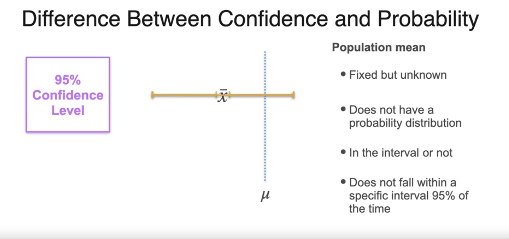

# Week 4

# Z Distribution

A **confidence interval** describes some degree of certainty for sample means.

$$
\text{lower limit} < \bar{x} < \text{upper limit}
$$

$\alpha$ is the significance level and $1 - \alpha$ gives a confidence level.

As the sample size increases, the confidence interval shrinks.

[Transcript](./z-distribution.txt)

# Margin of Error

[Transcript](./margin-of-error.txt)

# Calculation Steps

[Transcript](./confidence-interval-calculation.txt)

# Calculating Sample Size

What is the smallest sample size necessary to obtain a desired margin of error?

$$
\text{margin of error} = Z_{\frac{\alpha}{2}} \cdot \frac{\sigma}{\sqrt{n}}
$$

The necessary sample size $n$ for margin of error $MOE$ is

$$
n \ge \left( \frac{Z_{\frac{\alpha}{2}} \cdot \sigma}{MOE} \right)^2
$$

# Difference Between Confidence and Probability

[Transcript](./difference-between-confidence-and-probability.txt)

# Unknown Standard Deviation

[Transcript](./unknown-standard-deviation.txt)

# Unknown Mean and Standard Deviation

Given

- $\overline{X}$: sample mean
- $t_{\alpha / 2}$: student t
- $s$: sample standard deviation
- $n$: sample size

The confidence interval is:

$$
\left( \overline{X} - t_{\alpha / 2} \cdot \frac{s}{\sqrt{n}}, \overline{X} + t_{\alpha / 2} \cdot \frac{s}{\sqrt{n}} \right)
$$

# Confidence Interval for Proportions

How do you calculate a confidence interval for a given sample proportion?

[Transcript](./confidence-interval-for-proportion.txt)

# Defining Hypothesis

Null hypothesis $H_0$ and alternative hypothesis $H_1$ must be mutually exclusive and
have a true/false answer.

[Transcript](./defining-hypothesis.txt)

# Type I and Type II Errors

- Type I error (false positive)
    - you reject $H_0$ when it was actually true.
- Type II ( false negative)
    - you don't reject $H_0$ and the hypothesis was actually false

Type I errors are more severe than Type II errors. What is the greatest probability
of Type I error you are willing to tolerate? This is called the **Significance level**
($\alpha$).

# Right-Tailed, Left-Tailed, and Two-Tailed Tests

[Transcript](./right-left-two-tailed-tests.txt)

# p-Value

A **p-value** is the probability, assuming $H_0$ is true, that the test statistic takes
on a value as extreme as or more extreme than the value observed.

This means that from the observed value you moved the direction of $H_1$.

- If p-value is less than $\alpha$ reject $H_0$ and accept $H_1$ as true.
- If p-value is greater than $\alpha$ don't reject $H_0$.

[Transcript](./p-value.txt)

# Critical Values

- You can define the critical value in advance
- For a given sample, using p-value and critical value will lead to the same conclusion
- Defining a test in terms of critical values makes possible determining Type II error
- probabilities for the decision rule

[Transcript](./critical-values.txt)

# Power of the Test

[Transcript](./power-of-the-test.txt)

# Interpreting Results

[Transcript](./interpreting-results.txt)

# t-Distribution

[Transcript](./t-distribution.txt)

# t-Tests

[Transcript](./t-tests.txt)

# Test for Proportions

[Test for Proportions](./test-for-proportions.md)

# Two Sample t-Test

[Transcript](./two-sample-t-test.txt)

# Two Sample Test for Proportions

[Two Sample Test for Proportions](./two-sample-tests-for-proportions.md)

# Paired t-Test

[Transcript](./paired-t-test.txt)

# ML Application: A/B Testing

[Transcript](./a-b-testing.txt)
